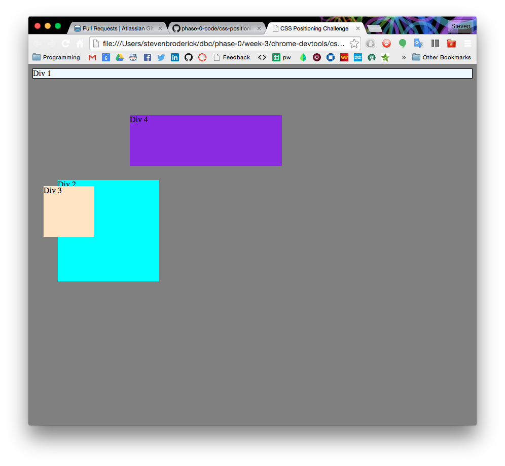
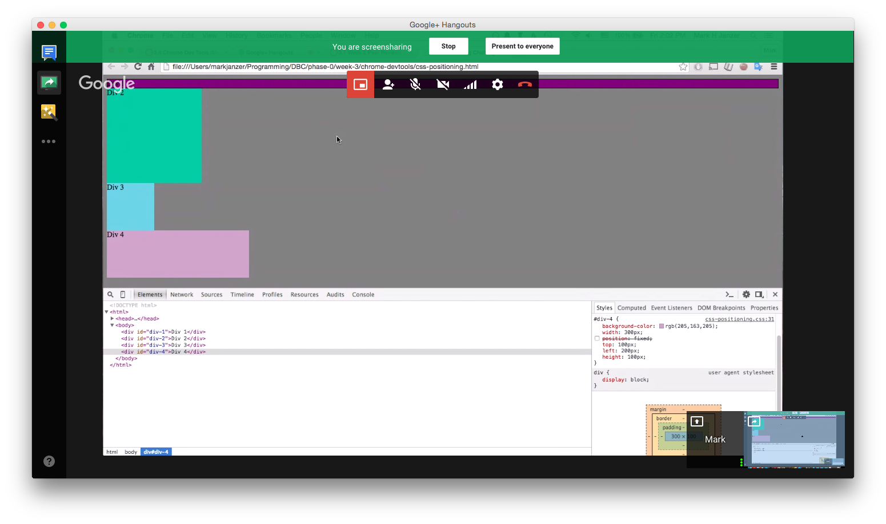
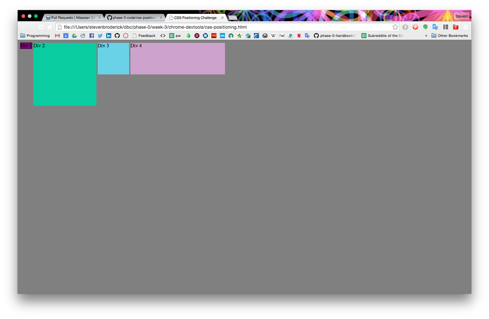
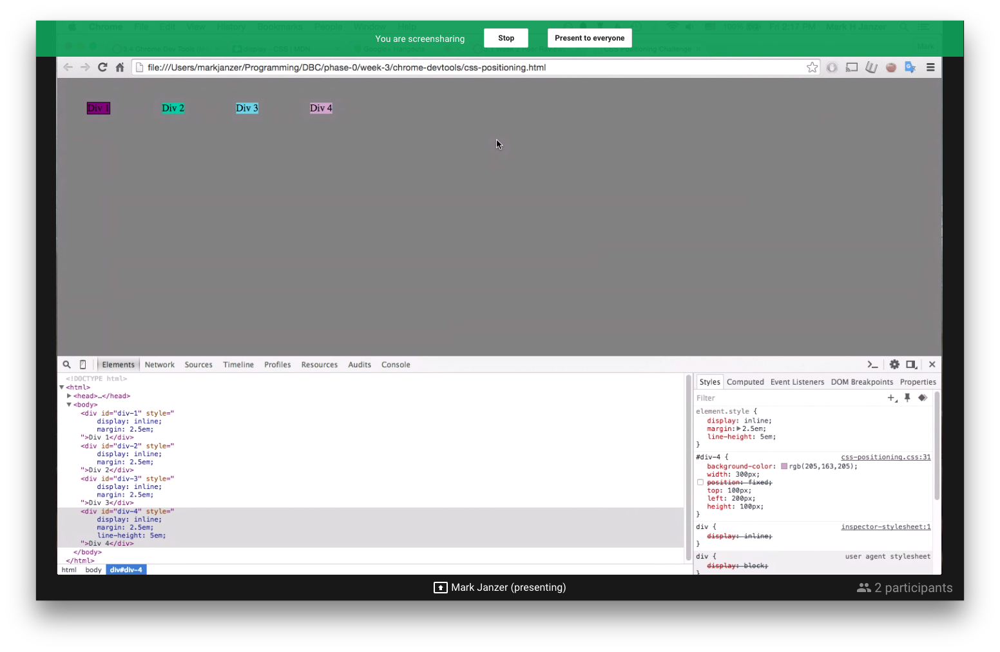
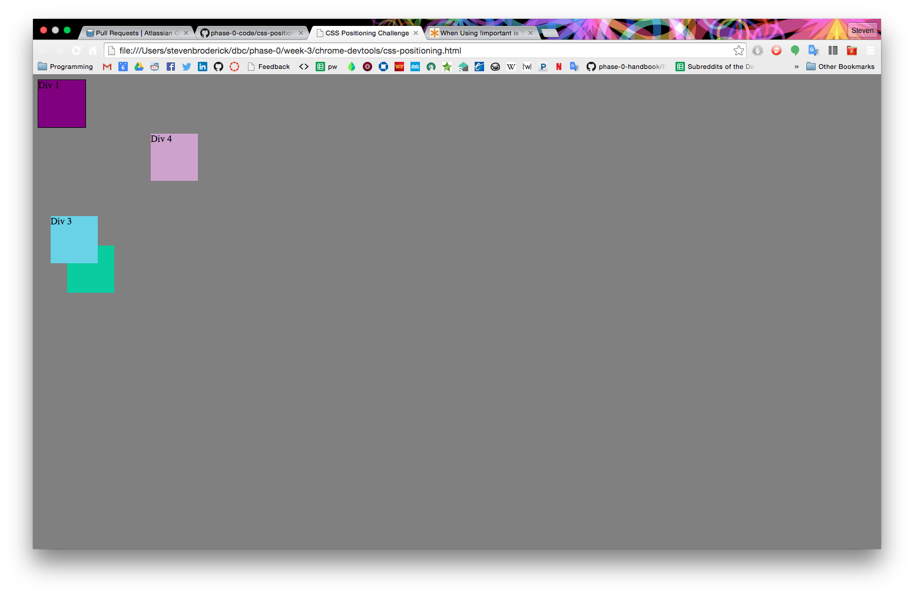
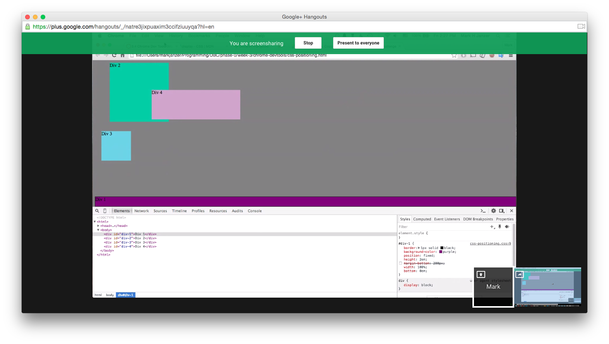
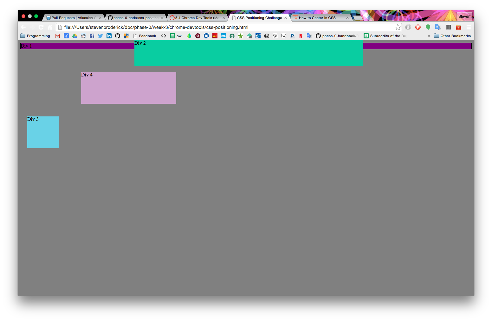
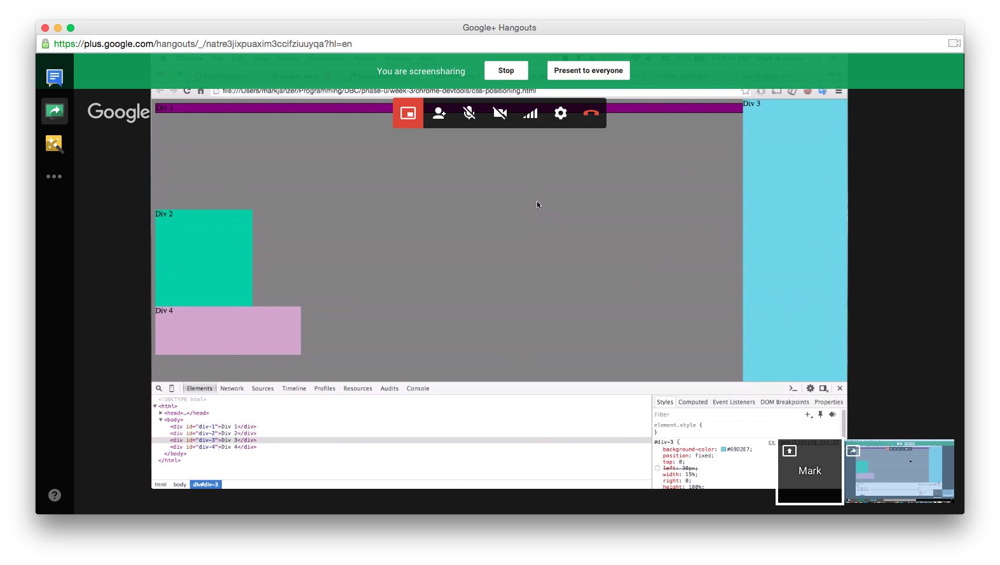
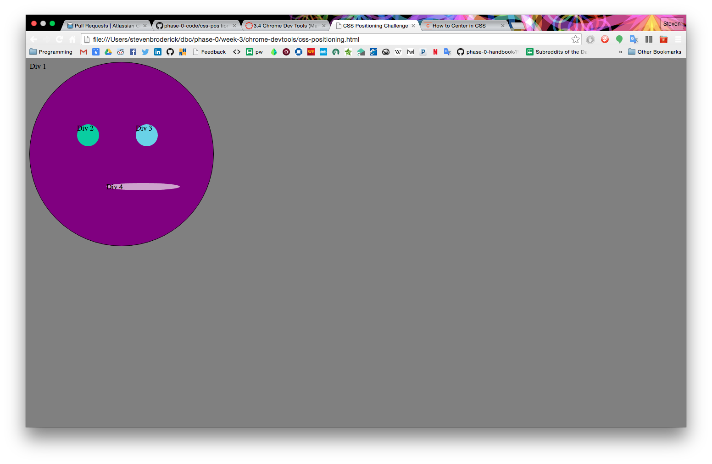

#Reflection 3.4

##How can you use Chrome's DevTools inspector to help you format or position elements?
The inspector gives you access to all of the element's properties for positioning/styling and allows you to change them easily. It also provides a nice visual display of elements that could otherwise be invisible (size, margins, padding).

##How can you resize elements on the DOM using CSS?
Yes, you can specify height and width, among other properties.

##What are the differences between Absolute, Fixed, Static, and Relative positioning? Which did you find easiest to use? Which was most difficult?
Static is the default positioning and will simply put the element on the page in order of its appearance in the DOM.

Relative, in combination with top/right/bottom/left properties, moves an element *relative* to where it would have been if it were static. Relative positioning is frequently used in conjunction with absolute positioning, for reasons stated below.

Fixed and absolute are very similar:

-A fixed element will not move from its position in the browser.

-An absolute element will not move from its position within another element, if the containing element has its position declared. If there is no containing element with a declared position, absolute works virtually the same as fixed. A common use of relative positioning is simply to create a container element for an absolute element to which it can attach.

##What are the differences between Margin, Border, and Padding?
A border is the boundary around an element as defined by its height and width properties (which are calculated automatically, if not deliberately defined). Borders are invisible by default, but can be given properties such as color and thickness.

Margin and padding can both create a kind of "spacing" around content, though they work differently and have distinct roles. Margin is the space outside of the border of an element that it will try to keep clear of other elements. Padding is the space within the border that it will try to keep clear of content, essentially pushing content away from the sides of the box (all elements are boxes).

##What was your impression of this challenge overall? (love, hate, and why?)
It was fun. We got stumped a couple times but we were always able to figure it out.

I will say that I think it would have made more sense to watch the videos on our own and not as part of this challenge. It's kind of hard to watch a video at the same time from different locations and the video material was very basic compared to some of the exercises we had completed this week already.