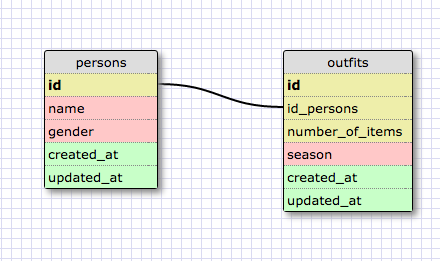

#CHALLENGE 8.4
##Release 5

####1. Select all data for all states.
    SELECT * FROM states;

####2. Select all data for all regions.
    SELECT * FROM regions;

####3. Select the state_name and population for all states.
    SELECT state_name, population FROM states;

####4. Select the state_name and population for all states ordered by population. The state with the highest population should be at the top.
    SELECT state_name, population FROM states
    ORDER BY population DESC;

####5. Select the state_name for the states in region 7.
    SELECT state_name from states WHERE region_id = 7;

####6. Select the state_name and population_density for states with a population density over 50 ordered from least to most dense.
    SELECT state_name, population_density FROM states
    WHERE population_density > 50
    ORDER BY population_density;

####7. Select the state_name for states with a population between 1 million and 1.5 million people.
    SELECT state_name FROM states
    WHERE population >= 1000000
    AND population <= 1500000;

####8. Select the state_name and region_id for states ordered by region in ascending order.
    SELECT state_name, region_id FROM states
    ORDER BY region_id DESC;

####9. Select the region_name for the regions with "Central" in the name.
    SELECT region_name FROM regions
    WHERE region_name LIKE '%Central%';

####10. Select the region_name and the state_name for all states and regions in ascending order by region_id. Refer to the region by name. (This will involve joining the tables).
    SELECT region_name, state_name FROM states
    INNER JOIN regions ON states.region_id=regions.id
    ORDER BY region_id;

##Release 6

##Reflection
####What are databases for?
They are for storing, organizing, and accessing large amounts of information.

####What is a one-to-many relationship?
It is a situation where you have several items in relationship where one of them is actually a category that contains the others, to the exclusion of other categories. For example, planets can be "gas giants" or "terrestrial", but they cannot be both. The planet and the category have a one-to-many relationship, where the category has many planets but the planets have only one category.

####What is a primary key? What is a foreign key? How can you determine which is which?
A primary key is a unique index that is required for uniquely identifying records in a SQL database/table. They are usually assigned automatically via incrementing or other mechanisms when a record is added.

A foreign key is the primary key in a different database/table that corresponds to the same record. It can be used to link the records from the two sources together via joining.

####How can you select information out of a SQL database? What are some general guidelines for that?
You can use a SELECT statement, in conjunction with operators, conditionals, and other commands. By convention, keywords are written in caps. As for general guidelines: be careful...?