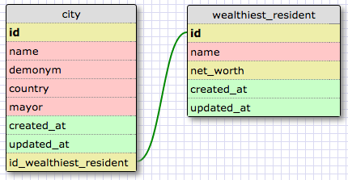

#CHALLENGE 8.4
##Release 2

The relationship between a city and its wealthiest resident is one-to-one, because only one person in a city can be the wealthiest (OK, a tie could occur, but that's incredibly unlikely).

In order for this to be a one-to-one relationship, the relationship must also work in reverse, meaning the wealthiest resident cannot be the wealthiest resident in more than one city. That requires a definition of "resident" that precludes residence in multiple cities. Let's assume that is the case in this dataset.

##Release 4

##Reflection
####What is a one-to-one database?
This is where each row in a dataset is linked to only one row in another dataset and vice versa.

####When would you use a one-to-one database? (Think generally, not in terms of the example you created).
I suppose it would help to partition the data into multiple tables, especially if I wanted to expand further on one of the items without adding extra columns to the original table. I actually had trouble thinking of a one-to-one example, because each example I thought of turned out to be a one-to-many or many-to-many relationship on closer examination.

####What is a many-to-many database?
This is where each row in a dataset can be linked to multiple rows in another dataset, and vice versa.

####When would you use a many-to-many database? (Think generally, not in terms of the example you created).
This would be a very common type of database, I think. I would use it when items can be part of multiple categories and categories can contain multiple items.

####What is confusing about database schemas? What makes sense?
It's a little hard for me to conceptualize without seeing the values in the fields. It would help if I could see what some of the actual records for these relationships look like. Other than that, it seems pretty straightforward; I just think I need more practice.